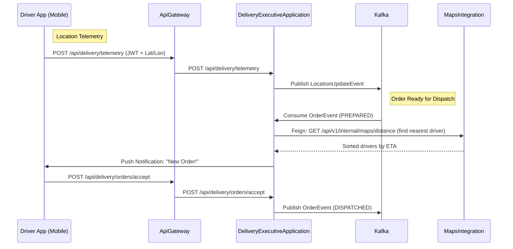

# DeliveryExecutiveApplication Architecture

This application manages the driver lifecycle and acts as a location telemetry producer for the rest of the ecosystem.

## Detailed Sequence Diagram

```mermaid
sequenceDiagram
    participant DriverApp as Driver App (Mobile)
    participant ApiGateway
    participant DeliveryApp as DeliveryExecutiveApplication
    participant Kafka
    participant MapsApp as MapsIntegration

    %% Driver Telemetry Flow
    note right of DriverApp: Location Telemetry
    DriverApp->>ApiGateway: POST /api/delivery/telemetry (JWT + Lat/Lon)
    ApiGateway->>DeliveryApp: POST /api/delivery/telemetry
    DeliveryApp->>Kafka: Publish LocationUpdateEvent
    
    %% Order Dispatch Flow (Event Driven)
    note right of Kafka: Order Ready for Dispatch
    Kafka->>DeliveryApp: Consume OrderEvent (PREPARED)
    DeliveryApp->>MapsApp: Feign: GET /api/v1/internal/maps/distance (find nearest driver)
    MapsApp-->>DeliveryApp: Sorted drivers by ETA
    DeliveryApp->>DriverApp: Push Notification: "New Order!"
    DriverApp->>ApiGateway: POST /api/delivery/orders/accept
    ApiGateway->>DeliveryApp: POST /api/delivery/orders/accept
    DeliveryApp->>Kafka: Publish OrderEvent (DISPATCHED)
```
