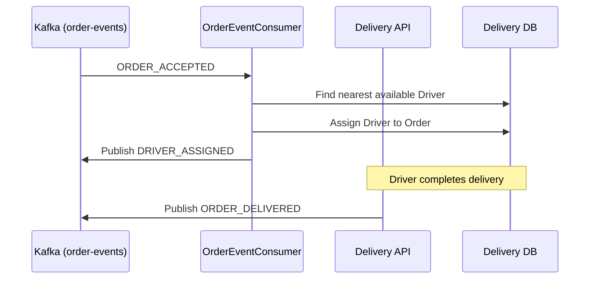

# Delivery Executive Application

The Delivery Executive Application manages the logistics side of the platform, tracking driver locations, availability, and dispatching.

## Responsibilities

1. **Driver Management**: Tracking active delivery executives and their locations (`PostGIS` spatial indexing).
2. **Dispatch Logic**: Listens for `ORDER_ACCEPTED` events from Kafka (which indicate the restaurant has begun preparing the food) and executes assignment algorithms to find the nearest available driver.
3. **Fulfillment Events**: Publishes `DRIVER_ASSIGNED` and `ORDER_DELIVERED` events back to Kafka, closing out the order lifecycle.

## Flow Diagram

## Setup

Requires PostgreSQL (`delivery_db` with PostGIS extension enabled) and Kafka. Run `mvn spring-boot:run`.
