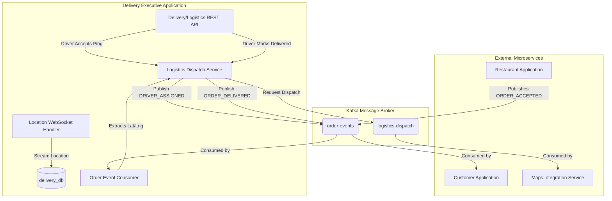
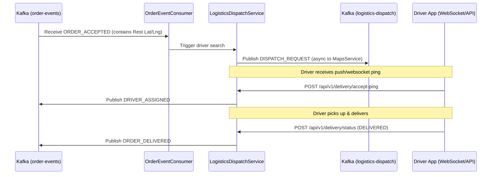

# Delivery Executive Application - System Flow Diagrams

This document illustrates the event-driven architecture and sequence flows of the `DeliveryExecutiveApplication`, handling driver logistics, real-time WebSocket location tracking, and order dispatching.

## High-Level Event Architecture

## Logistics Dispatch Sequence

